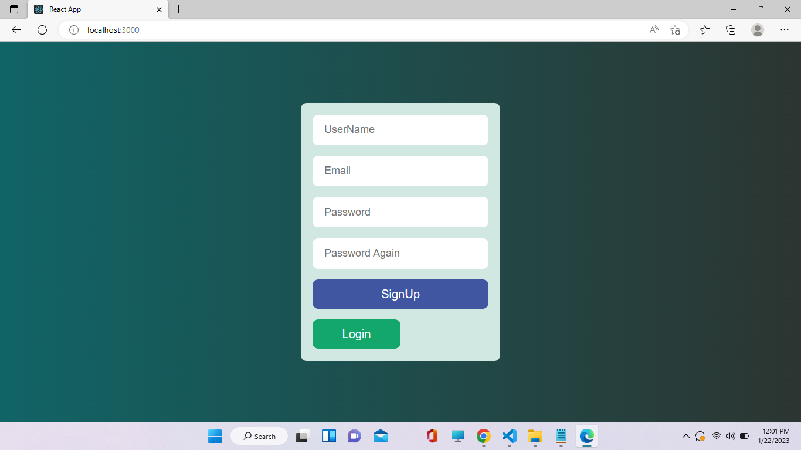
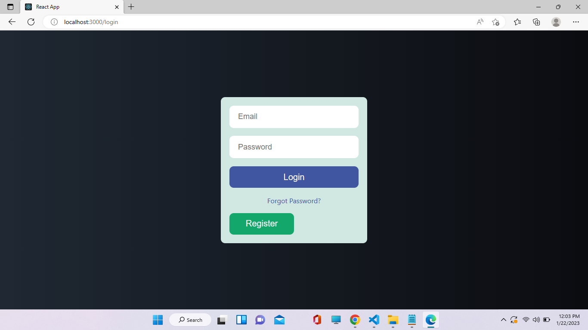
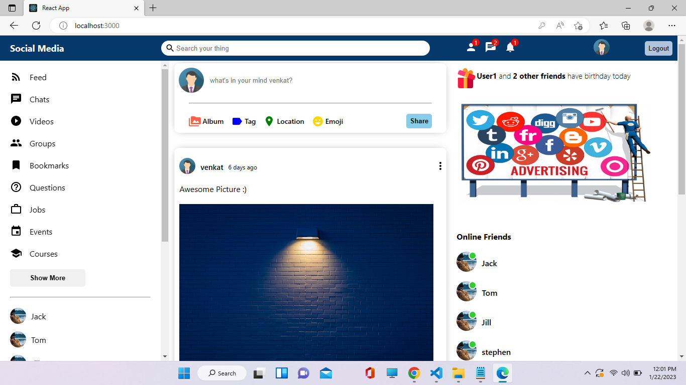
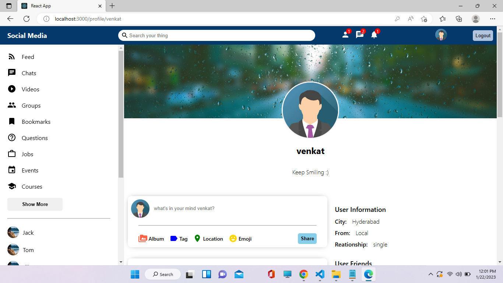

## Notes

```
This Project is built using MERN where user can Register & login with his credentials.
Created UI to upload & display the posts getting it from Database

Created API for post,put,get,delete the post's
```

## Styled Components

[Styled-Components - Main Docs](https://styled-components.com/)

```jsx
import styled from "styled-components";

const ReactComponent = () => {
 // logic here
 return <Wrapper>
 {some content}
 </Wrapper>
}


const Wrapper = styled.htmlElement`
write your styles here
`
export default ReactComponent
```

## Screenshots of Final Output

- RegisterPage
  

- LoginPage
  

- HomePage
  

- ProfilePage
  
